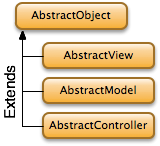

# The Core Framework

AbstractObject is a core class used in Agile Toolkit. This class is used by all the other classes in Agile Toolkit (except Exception classes) and offers number of core functionalities you can rely on. Further in this chapter I will include a code examples, where `$this` always refers to the object of Agile Toolkit.

## Descendants of AbstractObject

There are 3 direct descendants of AbstractObject which are:

* AbstractView - parent of all the Views - object capable of rendering themselves into HTML
* AbstractModel - parent of all classes which represent individual entity.
* AbstractController - for all the classes which implement a library-like functionality.

This chapter will focus on those four core classes.



