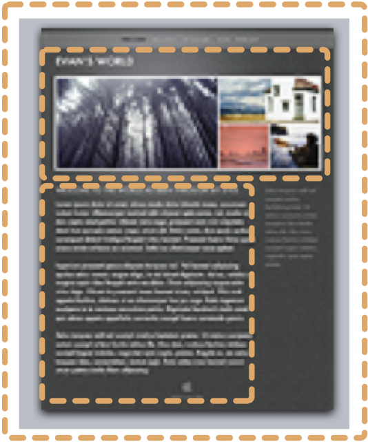

# Template Engine

Web software commonly relies on template engines to separate HTML from the rest of the logic code. Agile Toolkit also contains a template engine which is used extensively. The engine is designed to be simple and quick. It resembles a DOM tree interaction, but is faster and simpler. Here is a template example:

    <?greeting?>Hello, <?$name?>!! <?/greeting?>

## Features of SMLite Template Engine	

1. A passive template engine - template language contains no logic or complex code.
2. Tags define a placeholder where where  value can be inserted.
3. Regions represent the section inside a template, which may contain other tags or regions.

Tag is actually a self-closing Region, therefore SMLite does not distinguish between Tags and Regions. However for the sake of simpler understanding, I'll will be calling them separately.

## Basic Operations of SMLite	
SMLite is an object, instance of SMLite class which can load the template from a file. Typically files have .html extension in Agile Toolkit and are located under "template" subdirectory.

Template can also be cloned from another template, in which case you can specify a region. Everything within that region will become a new template and any operations with new template will not affect the main template.

Finally - you can specify both the filename and the region. This allows you to define multiple templates in a single file.

## Real-World workflow considerations

Concepts behind SMLite have formed over the course of 10 years by observing how designers work with templates and typical problems present in a conventional template systems.

* Extension .html makes it possible to open templates in browser or HTML editors directly (such as Dreamweaver) and edit them without risking to loose any data.
* The tags <?, ?> are commonly recognized by template parsers are unlikely to be a valid part of HTML document.
* Ability to initialize multiple SMLite copies from the same template file allows developer to preserve files in the way they when designer have created HTML file. This will allow designer to later do more modifications inside templates without wondering where did his code go.
* Lack of logic inside template files makes it simple for designers to read and understand tags. Often designers can create tags themselves without knowing application structure and relieve developer from this task.
* Ability to use tags as regions, gives ability to preserve original "Lorem Ipsum" text which was initially placed by designer, and then dynamically substitute it through the SMLite template.

Templates in Agile Toolkit are optimized for dynamic collaboration between developer and designer with minimum friction and maximum re-use of HTML code. The SMLite engine is designed to be quick, simply and extensible.

## Typical design workflow	

Lets review a typical situation when the design files are handed over from designer to developer. Design could come in a ZIP file with several .HTML files and subdirectories called "images", "css". 

Unpack it all inside templates/default folder of your Agile Toolkit software. Find the HTML file which is more likely to be a base for all the page's and rename it into 'shared.html'. That's all you need to do to create a basic theme for Agile Toolkit.



Your next action would be to outline some of the regions inside this file. It's likely that your designer have already added comments to mark beginning and ending of certain blocks.


The orange dashed line around your page indicates the boundaries of your “Application Template”. Unlike other systems (such as Wordpress) you don't create separate header / footer file. Instead the contents are substituted. Inside your template you can outline with the regions two blocks - the header part with images and the actual contents of the page which contains the text. You do not need to delete anything from your template, simply insert the tags. You can add more tags later and as long as they don't overlap, they will not break anything.

<div style="clear: both"></div>

## Operating with Templates directly

** DON'T DO THIS! I EXPLAIN THIS FOR LEARNING PURPOSES. ** 

Similarly to many other systems, you can load up a template and start manipulating it directly. Below is a sample code how you can do it:

```
$tpl = $api->add('SMLite')->loadTemplate('shared');
echo $tpl->set('Content')->set('Hello World')->render();
```


With this you load the template from shared.html file and replace <?Content?> region <?/Content?> with the new text. The header part would stay intact and will still contain pictures.

Note that I have replaced the region's content with a static content.

In Agile Toolkit SMLite is used as an underlying tool. You can occasionally use it directly, but most often you would be operating with the template through a View. As a skilled Agile Toolkit developer you should understand how template object is encapsulated inside a view and should be able to understand when is a good time to modify it. It's a good idea to avoid touching templates until you fully read the chapter about Views. 


## Performance Considerations	

Template system in Agile Toolkit is one of the most used pieces of code. Adding even slight feature inside SMLite can have a major impact on the overall performance of Agile Toolkit.

When Agile Toolkit reads a template, in creates a hash-map for all the regions inside a template and breaks down template to a sequence of nested arrays. Any operations with "set" are therefore linear and will not take any additional time even if you operate with huge templates. Rendering template is proportional to the number of tags in the template, but the complexity have a steady growth.


## Security Considerations	

SMLite is designed for producing HTML code (although it can be used to produce content in different formats too). Therefore when you use set() the variable you pass will automatically be encoded. You can specify anything for this method and it will be properly encoded. If you wish to inject a line of HTML inside your template you should use setHTML() or appendHTML(). 

Providing the simplest way to also be the most secure way to specify the content is the policy of Agile Toolkit to improve safety.

