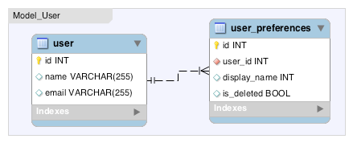

# Using Multiple SQL tables through Joins


Typical database manipulation systems (ORMs) would strictly bind your object definitions to match your database structure. Some would even look into the database for you and create model. Agile Toolkit allows you to have as many model classes as you need and each can also join as many tables as necessary.


I will start by looking at example with one-on-one relation. Even though the SQL relation is defined as 1:n, our application logic dictates that there will be only one record in user_preference at a time, with is_deleted=0. If we want to present user data and their display_name side-by-side we would need to create a join.

<div style="clear: both"></div>

```
class Model_User extends Model_Table {
	public $table='user';
	function init(){
		parent::init();
		$this->addField('name');
		$this->addField('email');
		$pref=$this->join('user_preferences.user_id');
		$pref->addField('display_name');
	}
}
```

My resulting model will still rely on the user table as a primary, and the user_id is used when loading the model, however model will automatically load display_name from user_preferences table, which will appear as a regular field in the model. As a developer working on a back-end you must understand, that model as you define it can be usable by virtually any UI element in Agile Toolkit without any additional tweaks or logic to handle the dependencies. You can purposely define multiple model classes for different use-cases.

Technically "join" in our example returns a new object of class SQL_Join, which can then be used as a proxy to create new field objects. SQL_Join class does not offer you a "addExpression" wrapper, because it wouldn't make a difference for expression anyway. Any fields created will keep reference to a join object. Here is alternative syntax for adding fields:

    $this->addField('display_name')->from($pref);

    

Presence of this property inside a field will affect it's prefix for the select queries but will also split "update" and "insert" operations into multiple queries. SQL_Join class will automatically determine which ID needs to be used where and will properly alter the sequence of operations.

If you create join with "leftJoin()" method, it will not perform any inserts or deletion to a joined table.

> If you are unsure if you should use "join" or "leftJoin", you should probably use "leftJoin"


defined | insert | delete | update
-----|--
`$user->join('preferences.user_id')` | user then preferences | preferences then user | both tables
`$user->join('address','address_id')` | address then user | user then address | both tables
`$user->leftJoin('preferences.user_id')` | user only | user only | both tables
`$user->leftJoin('address','address_id')` | user only | user only | both tables

leftJoin actually defines cascading preferences, but if you looking to use different type of joins inside select query, you can specify 3rd argument to the method. You can probably notice the similarity with `$dsql->join()`. 

You can also use on-to-one joins with join('pref.userId','userId'); but Agile Toolkit would still attempt to insert into one table first, then another.

## Dealing with Duplicate Fields	

Sometimes you would have the field with the same name present in both tables. Agile Toolkit does not permit multiple fields with same name within a model, so you would need to specify an actual field. This can be done with second argument passed to addField(); It works in the same way is with model fields.

    $pref->addField('is_pref_deleted','is_deleted')
	    ->type('boolean');

	    

	    