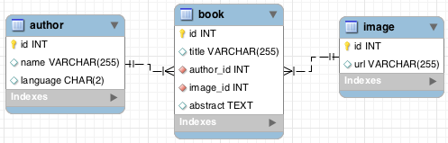

# How Agile Toolkit ORM is unique?

ORM (Object Relational Mappers) are software API layers which are designed to abstract data manipulation backend and create a simpler interface. If you have used ORMs you would know the downsides:

* Typical ORM have Exponential Complexity. Initially they offer a simpler way to access data, but as the demand of the application grows, you end up hacking around the ORM limitations to a point where it will become complex and un-stable.
* Most of ORM models use either XML or YAML to define data model and map tables against classes. As a problem you give up on Object-Oriented approach and the whole flexibility given to you by a Query language.
* Typical ORM implementations have a set of fields they go by and are rather inflexible about accessing data selectively. 
* Typical ORMs would only allow you to work with the defined models. You cannot change model definition dynamically.
* Schema refactoring affect existing models of ORMs and therefore can break your working code.
Manually extending SQL is often very difficult with ORMs.

> Agile Toolkit ORM solves ALL of the above problems elegantly 

## Complexity control	


Imagine the following data scheme: 

The typical ORM would create 3 classes, one class for each table and will also detect relationship between the tables to allow traversal. Now suppose, you need to show a page, which would contain titles of all the books by some author. Here is a typical way to do it with GENERIC ORM:

```
$author = authorfactory::find($_GET['id']);
$books = $author->books; 
foreach($books as $book){
   $url = $book->image[0]->url;
   // use $book->name / $url to display
}
```

The code seems simple enough, but unfortunately it generates large amount of queries: line #1 loads author and creates a query. line #2 traverses into books and also executes a query. It may also fetch all the books into memory (and it will include book abstracts, which is a large field, even though we might need only limited number of records. #4 traversing into "image" table would create one request per record creating a total of 1 simple query, 1 query with large result set and N more queries (for each result). If you know SQL, then you can write same thing in a single query:
    select name, url from book join image on image.id=book.image_id join author on author.id=author_id limit 20

Agile Toolkit ORM is much more efficient with the queries while retaining a simple object-oriented syntax. And I must add, that you do not need to define joins inside your "book" model for it to work (as you might not need them there all the time).


```
$author = $this->add('Model_Author');
$author->addCondition('id',$_GET['id']);
$books=$author->ref('Book');
$books->join('image')->addField('url');
foreach($books as $row){
  // use $books['name'] and $books['url']
}
```

The above code will produce the exact same query with two joins, even through the initial definition of books wouldn't have those joins defined.

> Agile Toolkit will not perform queries when traversing through SQL models


## Refactoring Benefits	


You might  think by now, why write 5 lines of Agile Toolkit ORM code if the same thing could be done by crafting a single SQL query? The benefit is the refactoring.

CASE1: Suppose our system-wide "Model_Author" must now be limited only to english authors. In Agile Toolkit you would modify init() method of the model to add addCondition('language','en'); As a result the query crafted for fetching books will also be affected appropriately throughout all the project.

If you would have used SQL code, you would need to go through all the queries where you somehow reference author table and double-check your condition. The typical case when this is a big problem is if you decide to implement "soft-delete".

CASE2: Suppose that you no longer wish to store image's URL but you would rather calculate it on the fly. Therefore you are looking to remove the field from the database and replace it with SQL expression.

If you are building your own SQL queries, then you would need to change all of your code throughout the project and copy-paste the exact expression into all the queries. Agile Toolkit allow you to define expressions as model fields and then re-use them. Here is a slightly updated code, which will perform a sub-select on the "image" table instead of join:

```
$author = $this->add('Model_Author');
$author->addCondition('id',$_GET['id']);
$books=$author->ref('Book');
$books->addExpression('url')->set(function($m){
    return $m->refSQL('image_id')->fieldExpr('url');
});
foreach($books as $row){
  // use $books['name'] and $books['url']
}
```

Now the Book will use model for the "Image" to retrieve the expression for URL no matter how complex it is. Naturally, if URL is just a table field it would also work fine.

The important benefit here is contingency of queries.

## Object-Oriented Models	

As you have already learned in the previous chapters, Model definition in Agile Toolkit is done through object-oriented classes. Therefore you can easily create a dedicated model for your type of query:

```
class Model_AuthorsBook extends Model_Book {
	function init(){
		parent::init();
		$this->join('author')
			->addField('author_lang','language');
		$books->addExpression('url')->set(function($m){
    		return $m->refSQL('image_id')->fieldExpr('url');		});
}
```

> While typical ORM associates Models with Tables, Agile Toolkit associates Models with Queries
## Actual Fields	


Models of Agile Toolkit will query all model fields by default. You can however use the setActualFields() method to specify a restricted set of fields which you need for your query.

There is another significant advantage of the way how models are defined with Agile Toolkit. Suppose you add a new join between a “book” and “book_info” table. It's possible that if you update your "Model_Book" with the join, it would affect your existing code. Therefore if a large amount of code already depends on this model, you can extend it into “Model_JoinedBook”, which implements the join. This approach will leave all your stable code un-changed.

## Manual Intervention into SQL	

While most ORM would rely on some internal mechanics for building the actual query - Agile Toolkit relies on DSQL. And since you are already familiar with this object, you can now extend it in any way you like to move complexity from PHP into SQL. For example, in order to add a field which would contain number of books each author have, you would need to add this line into init() method of Model_Author:

```
$this->addExpression('books_written')->set(function($m){
	$dsql = $m->refSQL('Book')->count();
	return $dsql;
});
$this->addExpression('full_name')->set(
	$this->dsql()->concat(
		$this->getElement('name'),
		' ',$this->getElement('surname') 
));
```

As a bonus, I also added expression for "full_name".

## Conclusions

Relational Models in Agile Toolkit are able to use PHP language to describe complex SQL queries but also abstract tables, fields, subqueries and conditions. This is all done with minimum overheads on the PHP side.

Advantages of using Agile Toolkit ORM are overwhelming. Consistency, stability, security, extensibility, abstraction are only few of the benefits. Before you could understand how to use Agile Toolkit ORM most efficiently, I must take you to one more diversion to introduce you to Model Fields.



